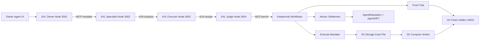

# Proofcourt 3-Sponsor Live Implementation Plan

Proofcourt targets exactly three sponsors: **Gensyn AXL**, **KeeperHub**, and **0G**.

The demo loop is:

`mandate -> AXL permit coordination -> KeeperHub execution -> 0G Case File -> 0G Compute verdict -> 0G Chain settlement/reputation -> tamper block`

## Prize Targets

- 0G: Best Agent Framework, Tooling & Core Extensions.
- 0G: Best Autonomous Agents, Swarms & iNFT Innovations.
- Gensyn AXL: Best AXL Application.
- KeeperHub: Best Use of KeeperHub.
- KeeperHub: Builder Feedback Bounty through `FEEDBACK.md`.

## Architecture

## Implementation Contract

- AXL uses four separate node roles: owner, specialist, executor, judge.
- KeeperHub uses three logical workflows: proof trial, execute mandate, atomic settlement.
- 0G is the evidence and settlement spine: Storage for Case Files, Compute for verdicts, Chain for evidence/reputation, and iNFT metadata pointers.
- The UI must expose live node IDs, execution IDs, tx hashes, log hashes, bundle hashes, roots, verdict hashes, and commit/abort tx hashes.

## Current Code Surfaces

- AXL adapter: `server/adapters/axlAdapter.ts`.
- KeeperHub adapter: `server/adapters/keeperHubAdapter.ts`.
- 0G Storage adapter: `server/adapters/zeroGAdapter.ts`.
- 0G Compute adapter: `server/adapters/zeroGComputeAdapter.ts`.
- Trust boundary: `server/services/integratedRun.ts`.
- Proof UI: `src/components/SponsorProofPanels.tsx`, `FinalProofSummary.tsx`, `TamperTestPanel.tsx`.
- Contracts: `contracts/ProofCourtEscrow.sol`, `WorkRegistry.sol`, `EvidenceRegistry.sol`, `AgentReputation.sol`, `ProofCourtCoordinator.sol`, `AgentINFT.sol`.

## Live Configuration Checklist

- Run `npm run axl:local` or connect four AXL nodes:
  - `AXL_OWNER_NODE_URL=http://127.0.0.1:3001`
  - `AXL_SPECIALIST_NODE_URL=http://127.0.0.1:3002`
  - `AXL_EXECUTOR_NODE_URL=http://127.0.0.1:3003`
  - `AXL_JUDGE_NODE_URL=http://127.0.0.1:3004`
- Set `KEEPERHUB_API_URL` and `KEEPERHUB_API_KEY`.
- Prefer phase workflow IDs:
  - `KEEPERHUB_TRIAL_WORKFLOW_ID`
  - `KEEPERHUB_EXECUTE_WORKFLOW_ID`
  - `KEEPERHUB_SETTLEMENT_WORKFLOW_ID`
- Use `KEEPERHUB_WORKFLOW_ID` only as a legacy single-workflow override for older workspaces.
- Set `ZERO_G_INDEXER_RPC`, `ZERO_G_RPC_URL`, and a funded `ZERO_G_PRIVATE_KEY`.
- Deploy contracts with `npm run contracts:deploy` and copy addresses into env.
- Set `EVIDENCE_REGISTRY_ADDRESS` and `EXECUTOR_PRIVATE_KEY` when recording verdict hashes from the executor wallet.

## Case File Schema

The 0G Case File is canonicalized around:

- `caseId`
- `mandateHash`
- `axlTranscriptHash`
- `trial`: proof-trial workflow ID, execution ID, tx hash, amount, log hash, receipt hash.
- `execution`: execute-mandate workflow ID, execution ID, tx hash, amount, logs, log hash, receipt hash.
- `verdict`: compliant flag, reason, confidence, model, source, verdict hash, compute attestation.
- `settlement`: payout status, prepare/commit/abort tx hashes, and iNFT royalty-share metadata.

## Demo Script

1. Start with Agent Registry: iNFT badges and live trust scores.
2. Generate a subscription/vault mandate.
3. AXL panel shows four node roles exchanging MCP and A2A envelopes.
4. KeeperHub proof-trial receipt appears before the real execution receipt.
5. KeeperHub execute-mandate receipt shows execution ID, logs, tx hash, and log hash.
6. 0G panel shows Case File root, bundle hash, storage tx, compute verdict, and attestation.
7. Settlement commits and reputation updates.
8. Tamper test flips the evidence root, triggers abort/block, and slashes trust.
9. Replay from 0G reconstructs the score from stored evidence history.

## Hard Blockers

- If 0G Compute is unavailable, the run must stop at verdict generation.
- If KeeperHub auth or workflow IDs are unavailable, the run must stop at the affected workflow phase.
- If contracts are not deployed or addresses are missing, prepare/commit/abort must fail closed.
- If iNFT metadata upload slips, the deployed `AgentINFT` contract may use 0G pointer placeholders, but the missing live metadata must be called out before submission.
